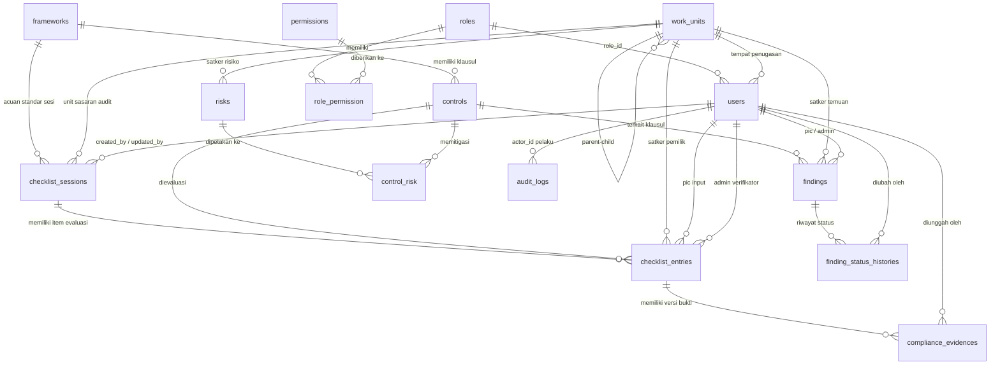

# 🗄️ Skema Basis Data (Database Schema) — SMKI Backend

PostgreSQL. Sumber kebenaran: `database/migrations/` (36 file) + `app/Models/`.
Dokumen ini sebelumnya menyebut 10 tabel — faktual saat ini: **16 tabel domain**
+ tabel infrastruktur Laravel.

---

## 📊 Diagram Entitas Relasi (ERD)

---

## 📋 Rincian Tabel Domain (16)

### 1. `roles` (Peran RBAC)
- `id` (PK, BigInt)
- `name` (String 50, Unique: `superadmin`, `admin_kepatuhan`, `koordinator_smki`, `auditor`, `pic` — di-seed via migrasi `add_role_id_to_users_table`)
- `label`, `description` (nullable)
- `created_at`, `updated_at` (tanpa soft delete)

### 2. `permissions` (Izin granular)
- `id` (PK, BigInt)
- `key` (String 100, Unique, e.g. `finding.create`, `risk.update`)
- `module` (String 50, indexed)
- `label` (nullable)
- `created_at`, `updated_at`

### 3. `role_permission` (Pivot peran ↔ izin)
- `role_id` (FK → `roles.id`, cascadeOnDelete)
- `permission_id` (FK → `permissions.id`, cascadeOnDelete)
- `created_at`, `updated_at`
- **PK komposit:** `(role_id, permission_id)`

### 4. `users` (Pengguna)
- `id` (PK, BigInt)
- `name`, `email` (Unique), `email_verified_at` (nullable), `password` (hash), `remember_token`
- `role_id` (FK → `roles.id`, nullable, restrictOnDelete). Kolom string `role` lama **sudah di-drop** (`2026_08_19_000103`); `$user->role` kini accessor nama peran (backward-compat read/write, `app/Models/User.php:49-69`)
- `unit_id` (FK → `work_units.id`, nullable, nullOnDelete)
- `created_at`, `updated_at` (tanpa soft delete)

### 5. `work_units` (Satuan Kerja)
- `id` (PK, BigInt)
- `nama` (String)
- `parent_id` (FK → `work_units.id`, nullable untuk Root, nullOnDelete)
- `created_at`, `updated_at`, `deleted_at`

### 6. `frameworks` (Standar SMKI)
- `id` (PK, BigInt)
- `nama` (String, e.g. `ISO/IEC 27001`, `ISO/IEC 27701`)
- `versi` (String, e.g. `2022`, `2025` — ISO 27701 di-bump `2019` → `2025` via migrasi data `2026_09_14_000002_bump_iso27701_to_2025`, upsert-only, kontrol pensiun tidak auto-hapus)
- `url_file` (nullable)
- `created_at`, `updated_at`, `deleted_at`

### 7. `controls` (Klausul & Kontrol Standar)
- `id` (PK, BigInt)
- `framework_id` (FK → `frameworks.id`, cascadeOnDelete)
- `kode_klausul` (String, e.g. `A.5.1`)
- `judul` (String), `deskripsi` (Text, nullable)
- `kategori` (String; model: `organisasional`, `orang`, `fisik`, `teknologi` — `app/Models/Control.php:25`)
- `domain_peran` (String, nullable; `controller` | `processor`, khusus 27701 — migrasi `2026_09_14_000001`)
- `created_at`, `updated_at`, `deleted_at`
- **Index:** `kode_klausul`, `kategori`, `domain_peran`
- **Unique parsial** `uniq_ctrl_fw_kode` `(framework_id, kode_klausul) WHERE deleted_at IS NULL` (pgsql/sqlite; MySQL fallback unique biasa — migrasi `2026_08_19_000001`). Baris soft-deleted tidak menempati slot unik.

### 8. `checklist_sessions` (Sesi Audit & Self-Assessment)
- `id` (PK, BigInt)
- `konteks_penilaian` (String), `periode` (String, nullable), `catatan` (Text, nullable)
- `unit_id` (FK → `work_units.id`, cascadeOnDelete)
- `framework_id` (FK → `frameworks.id`, nullable, nullOnDelete)
- `created_by`, `updated_by` (FK → `users.id`, nullable, nullOnDelete)
- `created_at`, `updated_at`, `deleted_at`
- **Index:** `(unit_id, periode)`, `(framework_id)`

### 9. `checklist_entries` (Lembar Evaluasi Kepatuhan Klausul)
- `id` (PK, BigInt)
- `session_id` (FK → `checklist_sessions.id`, nullable untuk backward compat, cascadeOnDelete — migrasi `2026_08_18_000002`)
- `control_id` (FK → `controls.id`, cascadeOnDelete)
- `unit_id` (FK → `work_units.id`, cascadeOnDelete)
- `pic_id` (FK → `users.id`, **nullable** sejak `2026_08_26_000001`, cascadeOnDelete)
- `admin_id` (FK → `users.id`, nullable, nullOnDelete)
- `status` (String, default `belum_dimulai`; workflow: `belum_dimulai`, `dalam_proses`, `dalam_tinjauan`, `selesai_diterapkan`, `tidak_berlaku` — `app/Models/ChecklistEntry.php:35-55`. Nilai legacy `compliant/partial/non_compliant/na` di-map via migrasi data `2026_09_19_163850`)
- `level_maturity` (TinyInt unsigned, nullable — migrasi `2026_09_14_000002`)
- `catatan`, `catatan_admin` (Text, nullable)
- `tanggal_input`, `tanggal_verifikasi` (Timestamp, nullable)
- `created_at`, `updated_at`, `deleted_at`
- **Index:** `(unit_id, status)`, `(unit_id, control_id)`, `(tanggal_input)`, `(session_id, control_id)`, `(session_id, status)`

### 10. `compliance_evidences` (Berkas Bukti, Multi-Versi)
- `id` (PK, BigInt)
- `checklist_entry_id` (FK → `checklist_entries.id`, cascadeOnDelete)
- `uploaded_by` (FK → `users.id`, cascadeOnDelete)
- `file_url` (String, path Supabase Storage S3 / URL)
- `version_number` (Integer, default 1), `is_active` (Boolean, default true — versi terkini; versi lama di-nonaktifkan via hook `creating`, bukan dihapus)
- `uploaded_at` (Timestamp, nullable)
- `created_at`, `updated_at`, `deleted_at`
- **Index:** `(checklist_entry_id, is_active)`
- **Unique:** `(checklist_entry_id, version_number)` — backstop anti-duplikat versi (`2026_08_19_000002`)

### 11. `findings` (Temuan Audit)
- `id` (PK, BigInt)
- `control_id` (FK → `controls.id`, cascadeOnDelete)
- `unit_id` (FK → `work_units.id`, cascadeOnDelete)
- `pic_id` (FK → `users.id`, cascadeOnDelete)
- `admin_id` (FK → `users.id`, nullable, nullOnDelete)
- `kategori` (default `observasi`: `major`, `minor`, `observasi`)
- `status` (default `open`: `open`, `in_progress`, `resolved`, `closed` — `app/Models/Finding.php:38-45`)
- `deadline` (Date, nullable), `catatan_admin` (Text, nullable), `tanggal_verifikasi` (Timestamp, nullable)
- `created_at`, `updated_at`, `deleted_at`

### 12. `finding_status_histories` (Riwayat Status Temuan)
- `id` (PK, BigInt)
- `finding_id` (FK → `findings.id`, cascadeOnDelete)
- `user_id` (FK → `users.id`, nullable, nullOnDelete)
- `from_status` (nullable), `to_status` (String), `catatan` (Text)
- `created_at`, `updated_at` (tanpa soft delete)
- **Index:** `(finding_id, created_at)`

### 13. `risks` (Register Risiko)
- `id` (PK, BigInt)
- `unit_id` (FK → `work_units.id`, nullable, nullOnDelete — migrasi `2026_09_02_000001`)
- `level_risiko` (default `low`: `low`, `medium`, `high`, `critical`)
- `pemilik_risiko` (String), `rencana_mitigasi` (Text, nullable)
- `status` (default `open`: `open`, `mitigated`, `accepted`)
- `catatan_admin` (Text, nullable)
- `created_at`, `updated_at`, `deleted_at`
- **Index:** `(unit_id, status)`
- ⚠️ `control_id` **sudah dihapus** (`2026_09_16_000002`, data di-backfill ke pivot dulu). Relasi kontrol kini M:N via `control_risk`. Index lama `(control_id, level_risiko)` ikut di-drop.

### 14. `control_risk` (Pivot risiko ↔ kontrol, M:N)
- `id` (PK, BigInt)
- `risk_id` (FK → `risks.id`, cascadeOnDelete)
- `control_id` (FK → `controls.id`, cascadeOnDelete)
- `created_at`, `updated_at`
- **Unique:** `(risk_id, control_id)` + index masing-masing kolom

### 15. `audit_logs` (Jejak Rekam — Anti Tamper)
- `id` (PK, BigInt)
- `entity_type` (String, nama model), `entity_id` (BigInt)
- `actor_id` (FK → `users.id`, nullable, nullOnDelete)
- `aksi` (String: `create`, `update`, `delete`, `upload`, `verify`)
- `detail_perubahan` (JSON, nullable)
- `created_at` saja (`UPDATED_AT = null`, tanpa `updated_at`, tanpa soft delete)

### 16. `notifications` (Notifikasi DB Laravel)
- `id` (UUID, PK)
- `type` (String), `notifiable_type` + `notifiable_id` (morphs), `data` (Text), `read_at` (nullable)
- `created_at`, `updated_at`
- **Index:** `(notifiable_type, notifiable_id, read_at)`
- Migrasi `2026_08_30_000003` hanya `ALTER PUBLICATION supabase_realtime ADD TABLE notifications` (pgsql + publikasi ada) — bukan perubahan skema.

---

## 🧱 Tabel Infrastruktur Laravel (standar, tanpa logika bisnis)

`password_reset_tokens` (`email` PK, `token`, `created_at`) · `sessions` (`id` PK, `user_id` nullable+index, `ip_address(45)`, `user_agent`, `payload`, `last_activity` index) · `cache` / `cache_locks` (`key` PK) · `jobs`, `job_batches`, `failed_jobs` (standar queue).

---

## 🔄 Migrasi Data / Izin (tanpa perubahan kolom)

- `add_role_id_to_users_table`: seed 5 role, backfill `role_id` dari string `role`, lalu drop `role`.
- `revoke_finding_create_delete_from_pic_role` (`2026_09_08`): cabut `finding.create/delete` dari PIC.
- `revoke_risk_create_delete_from_pic_role` (`2026_09_13_000001`): cabut `risk.create/delete` dari PIC.
- `grant_risk_crud_to_koordinator_role` (`2026_09_13_000002`): beri `risk.create/update/delete` ke Koordinator SMKI.
- `migrate_checklist_entry_status_to_workflow` (`2026_09_19`): map legacy → workflow + ubah default kolom.
- `migrate_risks_control_id_to_pivot` (`2026_09_16_000002`): backfill pivot lalu drop `risks.control_id`.
