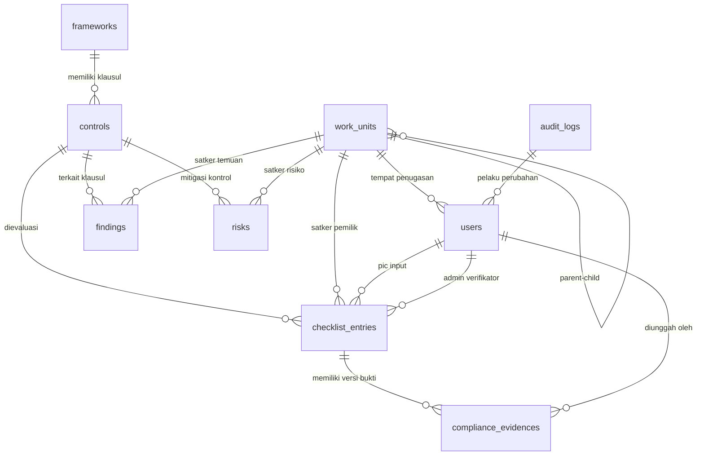

# 🗄️ Skema Basis Data (Database Schema) — SMKI Backend

Sistem Kepatuhan Digital SMKI menggunakan basis data relasional **PostgreSQL (Supabase)** dengan 9 tabel inti.

---

## 📊 Diagram Entitas Relasi (ERD)

---

## 📋 Rincian 9 Tabel Inti

### 1. `frameworks` (Standar SMKI)
- `id` (PK, BigInt)
- `nama` (String, e.g. `ISO/IEC 27001`, `ISO/IEC 27701`)
- `versi` (String, e.g. `2022`, `2019`)
- `url_file` (String, nullable)
- `created_at`, `updated_at`, `deleted_at`

### 2. `controls` (Klausul & Kontrol Standar)
- `id` (PK, BigInt)
- `framework_id` (FK -> `frameworks.id`)
- `kode_klausul` (String, e.g. `4.1`, `A.5.1`, `7.2.1`)
- `judul` (String)
- `deskripsi` (Text, nullable)
- `kategori` (String: `klausul_4_10`, `annex_a`)
- **Index Unik:** `(framework_id, kode_klausul)`

### 3. `work_units` (Satuan Kerja / Biro Organisasi)
- `id` (PK, BigInt)
- `parent_id` (FK -> `work_units.id`, nullable untuk Root)
- `nama` (String, e.g. `Biro Teknologi Informasi`, `Biro Hukum`)
- `created_at`, `updated_at`, `deleted_at`

### 4. `users` (Pengguna & Hak Akses Peran)
- `id` (PK, BigInt)
- `name` (String)
- `email` (String, Unique)
- `password` (String, Hash)
- `role` (Enum: `superadmin`, `admin_kepatuhan`, `koordinator_smki`, `auditor`, `pic`)
- `unit_id` (FK -> `work_units.id`, nullable)

### 5. `checklist_entries` (Lembar Evaluasi Kepatuhan Bulanan)
- `id` (PK, BigInt)
- `control_id` (FK -> `controls.id`)
- `unit_id` (FK -> `work_units.id`)
- `pic_id` (FK -> `users.id`)
- `admin_id` (FK -> `users.id`, nullable)
- `status` (Enum: `compliant`, `partial`, `non_compliant`, `na`)
- `catatan` (Text, catatan PIC)
- `catatan_admin` (Text, catatan verifikator Admin)
- `tanggal_input` (Timestamp)
- `tanggal_verifikasi` (Timestamp, nullable)
- **Index Performa:** `(unit_id, status)`, `(unit_id, control_id)`, `(tanggal_input)`

### 6. `compliance_evidences` (Berkas Dokumen Bukti & Multi-Versi)
- `id` (PK, BigInt)
- `checklist_entry_id` (FK -> `checklist_entries.id`)
- `uploaded_by` (FK -> `users.id`)
- `file_url` (String, path Supabase Storage S3)
- `version_number` (Integer: 1, 2, 3...)
- `is_active` (Boolean: true untuk versi terkini)
- `uploaded_at` (Timestamp)
- `deleted_at` (Timestamp, soft delete)

### 7. `findings` (Temuan Audit / Ketidaksesuaian)
- `id` (PK, BigInt)
- `control_id` (FK -> `controls.id`)
- `unit_id` (FK -> `work_units.id`)
- `pic_id` (FK -> `users.id`)
- `admin_id` (FK -> `users.id`, nullable)
- `kategori` (Enum: `major`, `minor`, `observasi`)
- `status` (Enum: `open`, `in_progress`, `closed`)
- `deadline` (Date, nullable)
- `catatan_admin` (Text, nullable)
- `tanggal_verifikasi` (Timestamp, nullable)

### 8. `risks` (Register Risiko Keamanan Informasi)
- `id` (PK, BigInt)
- `control_id` (FK -> `controls.id`)
- `unit_id` (FK -> `work_units.id`)
- `pic_id` (FK -> `users.id`)
- `deskripsi_risiko` (Text)
- `kemungkinan` (Integer, skala 1-5)
- `dampak` (Integer, skala 1-5)
- `tingkat_risiko` (Enum: `rendah`, `sedang`, `tinggi`, `kritis`)
- `rencana_mitigasi` (Text, nullable)

### 9. `audit_logs` (Jejak Rekam Digital Sistem - Anti Tamper)
- `id` (PK, BigInt)
- `user_id` (FK -> `users.id`, nullable)
- `action` (String: `created`, `updated`, `deleted`, `restored`)
- `auditable_type` (String, Polymorphic model class)
- `auditable_id` (BigInt, ID record model)
- `old_values` (JSON, nullable)
- `new_values` (JSON, nullable)
- `ip_address` (String, nullable)
- `user_agent` (String, nullable)
- `created_at` (Timestamp)
